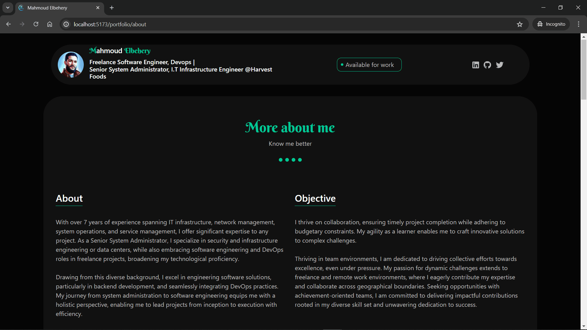
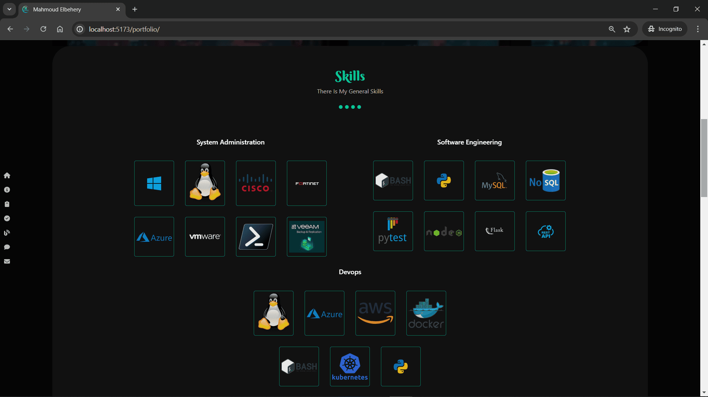
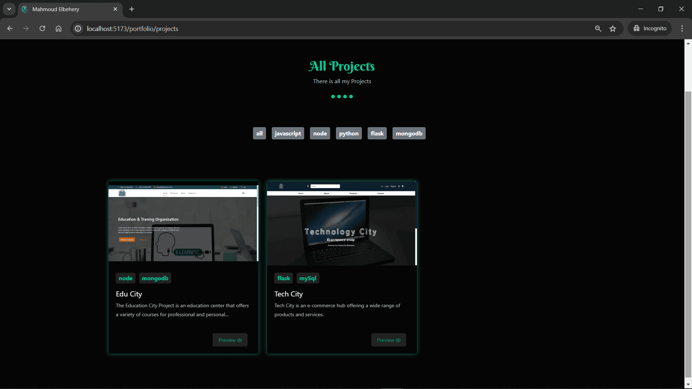

# Mahmoud Elbehery Portfolio

Welcome to Mahmoud Elbehery's portfolio project! This portfolio is designed to showcase Mahmoud's projects and provide information about his skills and expertise to attract work opportunities.

## Key Features

- **Header**: Consistent navigation across all pages.
- **About**: Detailed information about Mahmoud Elbehery
- **Skills**: A section listing Mahmoud's skills and proficiencies.
- **Projects**: Showcases Mahmoud's portfolio projects with descriptions and links to project details.
- **Blogs**: Contains articles or blog posts written by Mahmoud, showcasing his knowledge and interests.
- **Contact**: Information and forms through which visitors can reach out to Mahmoud.
- **Footer**: Provides additional navigation links and contact information.

## Screenshots






## Live Demo

Check out the live demo: [Live Demo Link](https://mahmoudramy84.github.io/portfolio/)

## Installation Instructions

### Prerequisites

Before you begin, ensure you have the following installed on your local machine:

- Node.js (version X.X.X or higher)
- npm (Node Package Manager) or yarn

### Getting Started

1. **Clone the Repository**

   ```bash
   git clone <repository_url>
   cd <project_directory>
   ```

2. **Install Dependencies**

   ````
   npm install
   # or
   yarn```
   ````

3. **Run the Development Server**

   ````
   npm run dev
   # or
   yarn dev```
   ````

4. **Open in Browser**

   Navigate to http://localhost:3000 (or another port specified by Vite) in your web browser to view the portfolio.

## Contact Information

For any feedback or inquiries, feel free to reach out to Mahmoud Elbehery through:

- LinkedIn: [Mahmoud Elbehery on LinkedIn](https://www.linkedin.com/in/mahmoud-ramy-elbehery-752aab235)
- GitHub: [Mahmoud Elbehery on GitHub](https://github.com/mahmoudramy84)
- Twitter: [Mahmoud Elbehery on Twitter](https://twitter.com/mahmoudramy84)
